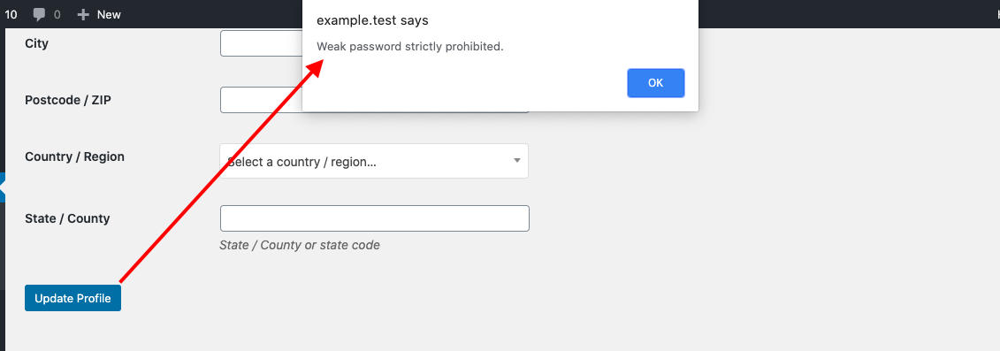

# wp-strong-password
Prevent user from using weak password from WP_CLI and WordPress backend.

## Installing

- Clone this plugin in your plugins directory.
- Execute `composer install` in plugin (wp-strong-password) directory.
- Activate plugin from backend or using WP-CLI.

## Development tools

- https://github.com/bjeavons/zxcvbn-php
- WordPress password strength meter

## Screenshots

Creating new user with weak password

Updating weak password from CLI

Updating weak password from backend

